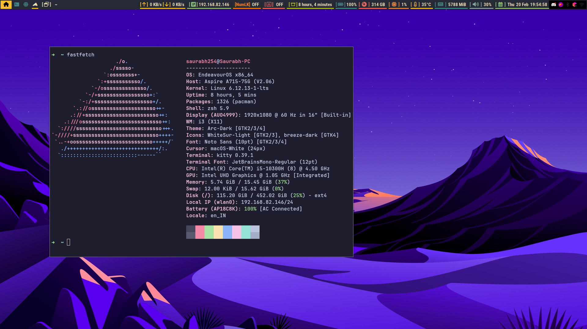

# PolyBar themed with i3wm

#### Rice Info:
- OS : Endeavour OS
- DE : i3wm configured
- bar: polybar




Image contains: fastfetch

## Installation

Follow the instruction to install the configuration

### Install polybar

For Arch Linux / EndeavourOS
```bash
sudo pacman -S polybar
```

For Debian based system (ubuntu, kali etc)
```bash
sudo apt-get install polybar
```

For Fedora users
```bash
sudo dnf install polybar
```

### Install fonts

For Arch Linux / EndeavourOS
```bash
sudo pacman -S ttf-roboto ttf-font-awesome noto-fonts ttf-firacode-nerd
```

### Other distros Debian/Fedora

Install the fonts manally
- roboto
- font awesome 6
- noto fonts
- firacode nerd
## Config Installation

To proceed with the installation execute the given commands in the terminal

#### For polybar Installation without i3 config

```bash
git clone https://github.com/Saurabh254/polybar-with-i3wm.git
cd polybar-with-i3wm
cp -R polybar ~/.config/
```

#### For polybar installation with i3 config

```bash
git clone https://github.com/Saurabh254/polybar-with-i3wm.git
cd polybar-with-i3wm
cp -R polybar ~/.config/
cp -R i3 ~/.config
```

> Note: i3wm Keybindings are same as of Endeavour os i3wm keybinding


Now the installation is completed.
##### You can logout and login or reboot you pc. To get started.

Thank you :)
